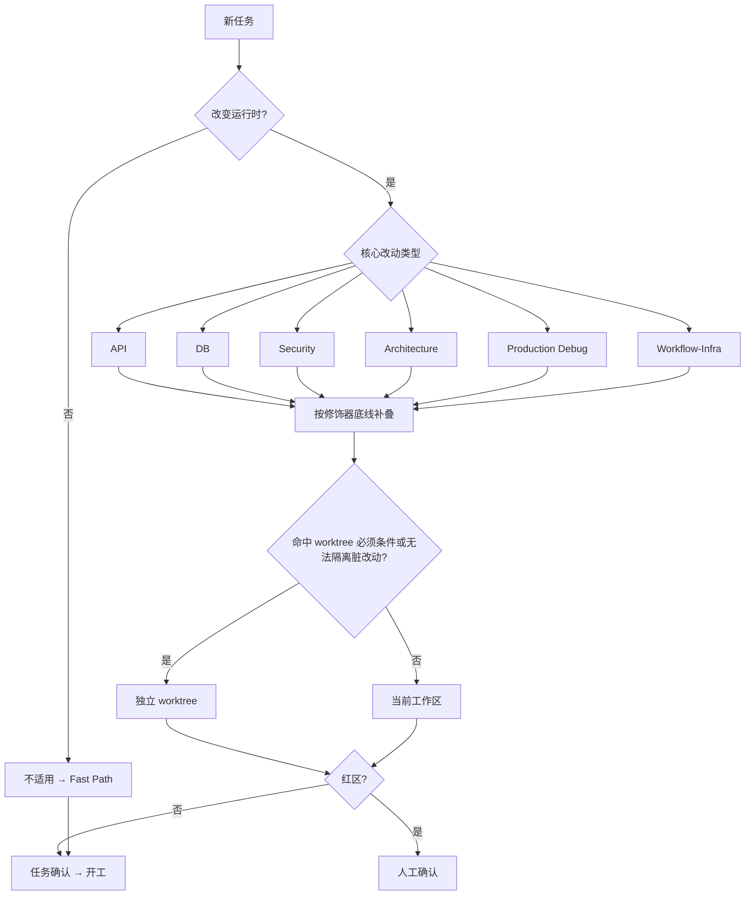

# DYNAMIC_WORKFLOW_RULES.md — 动态任务路由

本文件定义后端任务如何选主 Workflow、叠加强制修饰器，以及 Workflow Packet 字段语义。协作边界与 Memory 总规则见 `../AGENTS.md`。

## 总规则

1. 先选**主 Workflow**，再按风险叠**修饰器**（全集如下，不得扩展）：
   - 主 Workflow：`API` / `DB` / `Security` / `Architecture` / `Production Debug` / `Workflow-Infra` / 不适用
   - `Security`：认证、授权、患者/报告信息、脱敏、审计、敏感日志
   - `DB`：迁移、种子、SQL、表结构、索引、约束、数据兼容、回滚
   - `Red Team`：高风险、跨层、生产问题、权限/数据/报告
   - `Frontend Cross-check`：须对照 `SYBaseProjectWeb` 消费方式或验证

2. **低风险退出**：纯文档、测试-only、注释-only 可标注 Workflow 不适用。绿区默认**不更新** memory、交付可省略 Memory 判定（见 `../AGENTS.md` §8）。不得覆盖 Security/DB/红区/跨仓/生产问题。

3. **Packet 档位**（与 MR 模板一致）：
   - Fast Path：Workflow 不适用 + 验证；Memory 判定可选
   - Lightweight：主 Workflow + 触发信号 + 验证 + 剩余风险；Memory 判定仅 durable 变更时填写
   - Full：完整 Packet + Red Team 最低证据 + Memory 判定（有变更时）

4. MR 必须填写对应档位的 Workflow Packet，说明为什么选择该 Workflow、启用哪些专家 Agent、跑了哪些动态测试和模拟、红队攻击结论是什么。

5. 跨仓口径与前端 `SYBaseProjectWeb/docs/rules/DYNAMIC_WORKFLOW_RULES.md` 互为镜像；改分类/修饰器须同步评估另一仓。

- 两仓主 Workflow 分类与修饰器语义保持一致；前端额外有 UI Workflow 与 Browser 验证修饰器，后端无 UI 类任务
- 平台差异：前端走 GitHub PR（`pr-packet.yml` 自动校验 Workflow Packet 字段），后端走 GitLab MR（`verify` 阶段含 `verify_governance` 治理校验，Packet 由 MR 模板与人工审查把关）
- 跨仓任务的双向引用是硬要求：后端 MR 描述中写明前端 PR 链接与前端验证结论，前端 PR 同理；记忆文件（`DECISIONS.md` 等）中的跨仓条目也必须双向引用
- 修改任一仓的 Workflow 分类、修饰器全集或 Packet 字段语义时，必须同步评估另一仓对应文档并在 MR/PR 中说明

## 触发信号速查表

任务开始时先按"改动路径 / 需求信号"查下表选主 Workflow，再按命中行叠加必叠修饰器。一个任务可能命中多行：主 Workflow 取最贴近核心改动的一项，其余命中项作为修饰器叠加。判断有歧义或跨多类时，从严就高（优先叠加 Security / DB / Red Team）。

| 改动路径 / 需求信号 | 主 Workflow | 必叠修饰器 |
| --- | --- | --- |
| Controller、Request/Response、错误码、分页、接口路径、字段映射、前端联调 | API | Frontend Cross-check（跨仓时） |
| `db/migration`、Flyway、SQL、种子数据、索引/约束、回滚、历史数据兼容 | DB | DB、Red Team |
| 认证、授权、角色、数据范围、患者信息、报告信息、脱敏、审计日志 | Security | Security、Red Team |
| `domain` / `repository` 边界、共享模块、大文件重构、跨模块依赖 | Architecture | Red Team（跨层时） |
| 生产问题、线上故障、性能回退、`.logs/` 中已有错误 | Production Debug | Red Team、Frontend Cross-check（跨仓时） |
| Git hooks、GitLab CI、镜像、部署脚本、环境变量、发布路径 | Workflow-Infra | Red Team（红区时） |
| 纯文档、注释、闲聊或信息查询，不改运行时行为 | 不适用（标注原因即可） | 无 |

修饰器叠加底线：权限/患者/报告 → Security；DB → DB；高风险/跨层/生产 → Red Team；跨仓 → Frontend Cross-check。

## 决策流程图

## Workflow Packet

**完整 Workflow Packet** 字段：

- 主 Workflow
- 触发信号
- 专家 Agent
- 动态测试 / 动态模拟
- 动态安全 / 动态数据库（若触发修饰器）
- Red Team
- Memory Update

**轻量 Workflow Packet** 字段：

- 主 Workflow
- 触发信号
- 动态测试（或 Summary Validation 已写清则省略）
- Memory Update（**仅 durable 变更时**）
- 剩余风险 / 未验证项

高风险最低证据：Red Team 须含攻击路径、预期失败点、实际结果、剩余风险；启用 Checker 须说明来源与结论。

## Memory Layer

Memory 是否更新以 `../AGENTS.md` §8 为准；本节只列常见示例，不新增触发条件。交付前判断本次任务是否产生持久上下文：

- 项目状态变化：更新 `PROJECT_STATE.md`
- 技术债发现或状态变化：追加或更新 `TECH_DEBT.md`
- 已知 bug 发现、复现或修复：追加或更新 `KNOWN_BUGS.md`
- 影响后续协作的决策：追加 `DECISIONS.md`
- 稳定架构边界、跨仓接口或约束变化：更新 `ARCHITECTURE.md`

强制重点：

- Security Workflow 必须特别检查 `KNOWN_BUGS.md`、`DECISIONS.md`、`ARCHITECTURE.md`
- DB Workflow 必须特别检查 `TECH_DEBT.md`、`KNOWN_BUGS.md`、`DECISIONS.md`、`ARCHITECTURE.md`
- Production Debug Workflow 必须特别检查 `PROJECT_STATE.md`、`KNOWN_BUGS.md`、`DECISIONS.md`
- Architecture Workflow 必须特别检查 `DECISIONS.md`、`ARCHITECTURE.md`，必要时更新 `TECH_DEBT.md`
- 跨仓任务必须双向引用前后端记忆项和验证证据

不做流水账式“无变化”更新；未更新的文件只在交付摘要和 MR Memory Update Packet 中说明原因。

## 各 Workflow 要点

| Workflow | 专家 / 验证 | 动态模拟 | Red Team 重点 | Memory 示例 |
| --- | --- | --- | --- | --- |
| **API** | API Contract + Frontend Cross-check；`./mvnw -pl <module> -am test/verify`，必要时 API 回归 | 成功/错误/空数据/重复提交/超时/旧字段兼容；前端真实 payload | 破坏旧接口、字段映射或错误码；泄露内部异常、敏感字段、持久化对象 | 契约结论 → `DECISIONS`；兼容债/联调缺陷 → `TECH_DEBT`/`KNOWN_BUGS`；跨仓双向引用 |
| **DB** | DB/Migration + Red Team；`./mvnw -pl bl-center -am verify` 或受影响模块 verify；目标环境前演练 Flyway | 空库/旧数据/新数据/重复执行/部分失败/回滚后查询；达梦差异 | 丢数据、重复写、破坏索引/约束、不可重复执行、无法回滚、旧前端读取失败 | 迁移/回滚/约束 → `TECH_DEBT`/`KNOWN_BUGS`/`DECISIONS`/`ARCHITECTURE` |
| **Security** | Security/Privacy + Red Team；受影响模块权限/接口测试；必要时 auth/user/bl-center 测试 | 未登录、低权限、跨角色、跨数据范围、报告导出、错误日志 | 越权、泄密、审计盲区、只在前端隐藏入口而后端无兜底 | 安全结论 → `KNOWN_BUGS`/`DECISIONS`/`ARCHITECTURE`；安全债 → `TECH_DEBT` |
| **Architecture** | Architecture + Codegraph；`./mvnw -pl <module> -am verify`，必要时 `./mvnw clean verify` | 旧/新调用方、仓储替换、事务边界、失败分支 | 越层依赖、浅模块、万能 service、共享模块业务耦合、缺公共接口回归 | 边界变化 → `ARCHITECTURE`；取舍 → `DECISIONS`；持久问题 → `TECH_DEBT` |
| **Production Debug** | Diagnose + Execution；先读 `.logs/backend.log`，构造反馈环，再写回归测试；前端相关同步引用前端日志/验证 | 日志回放、请求重放、目标环境配置差异、慢查询、异常数据 | 未复现就修复、只修表象、缺回滚/监控/失败证据 | 生产阻塞 → `PROJECT_STATE`；复现故障 → `KNOWN_BUGS`；处置决策 → `DECISIONS` |
| **Workflow-Infra** | Workflow-Infra；对应 hook/CI/脚本命令，必要时 `./mvnw clean verify` 或 CI 同口径验证 | Windows/Linux 差异、缺变量、缺权限、目标路径、镜像 tag 回滚 | 绕过 hook/CI/部署审批、脚本改写非目标文件、泄露密钥、硬编码本机路径、失败不可定位 | 环境约束 → `PROJECT_STATE`/`DECISIONS`；工具边界 → `ARCHITECTURE`；阻塞/债务 → `KNOWN_BUGS`/`TECH_DEBT` |
